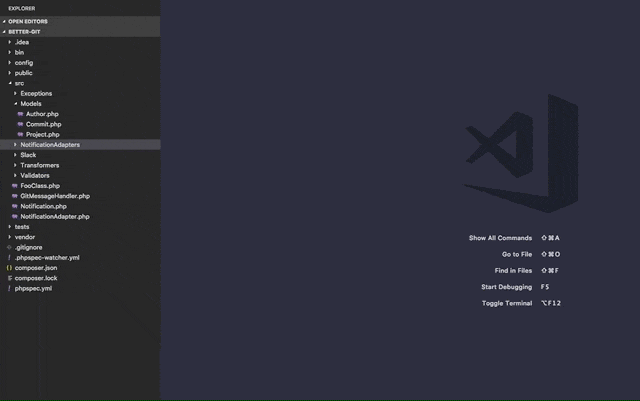
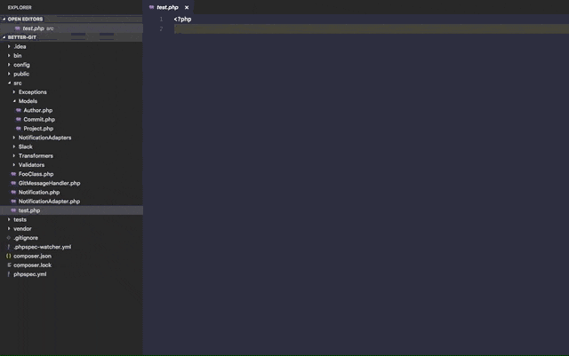
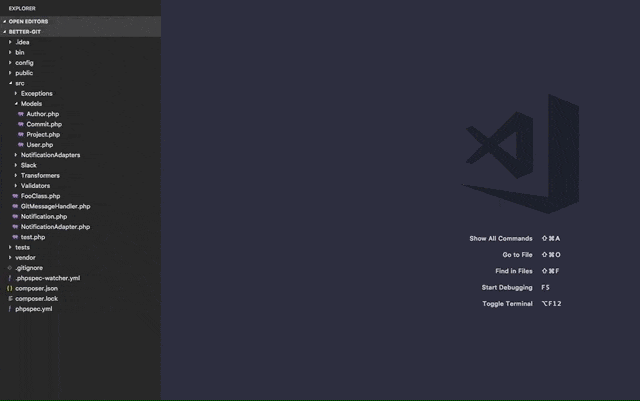
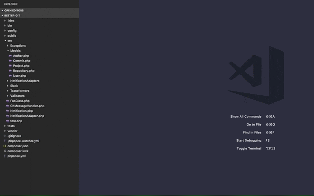

# PHP File Types

An extension for creating PHP files, classes, interfaces and traits via context menu or through the Command Palette.

## Features

### New PHP File

### New PHP Class

### New PHP Interface

### New PHP Trait

### Namespace Detection
For classes, interfaces and traits the extension tries to lookup the correct namespace via the `composer.json` file. If no namespace can be determined automatically an additional input is shown.

## License

The MIT License (MIT). Please see the [License File](LICENSE) for more information.